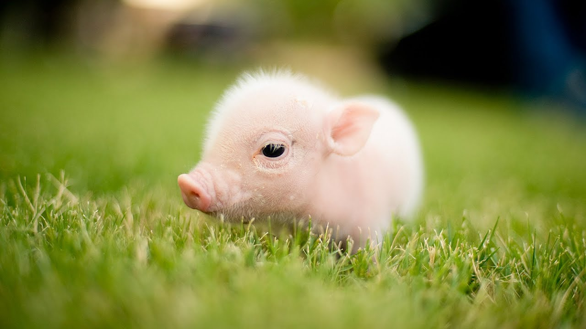
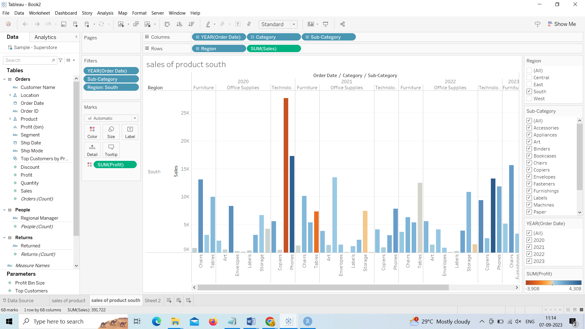
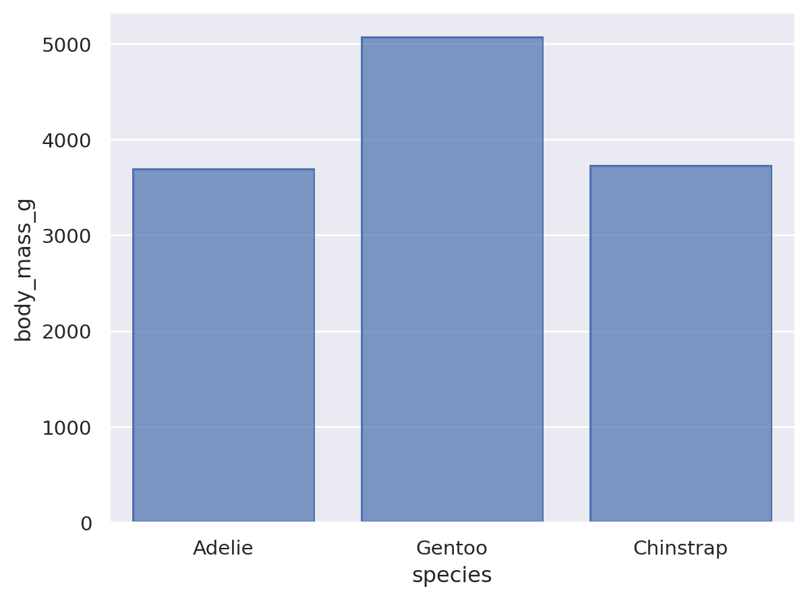
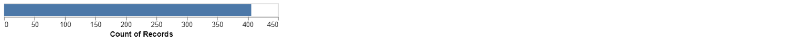

---
output:
  pdf_document: default
  html_document: default
---
# HW 1 - CS 625, Fall 2023

Eswari Kannipoti  
Due: September 6, 2023

## Git, GitHub

*What is the URL of the GitHub repo that you created in your personal account?*
 
    https://github.com/Eswarikannipoti/HW-1-report/
   
*In which direction does the 'pull' command work (send local changes to remote OR send remote changes to local)?*
The Pull command is used to send remote changes to local.
   
*If you have committed a change on your local machine, but do not see the update on GitHub.com, what step might have you forgotten?*
If we cannot see the update on github we might have forgotten to use the push command.

## Markdown

*Create a bulleted list with at least 3 items*

Hey, I'm Eswari Kannipoti

*I'm a master's student at ODU*.

**This is course CR-625**.

I live in 1049 W APR 103.

Google: [google](https://www.google.com/).

*Write a single paragraph that demonstrates the use of italics, bold, bold italics, code, and includes a link. The paragraph does not have to make sense.*

*Create a level 3 heading*
### FIRST HOME WORK IN MASTERS

*Insert an image of an animal, sized appropriately*

## Tableau

*Insert your the image of your final bar chart here. Reminder, this should show data from a region other than the South.*

## Google Colab

*What is the URL of your Google Colab notebook?*

     https://colab.research.google.com/drive/1edLxzvehDprqhVh4wwvvL_-toNlxdg-e?usp=sharing

**Python/Seaborn**

*Insert the first penguin chart here*

*Describe what the figure is showing.*

     In the above image the graph presents the information about bill_length_mm and bill_depth_mm in x and y axes, where bill_length_mm with range 35 to 60 and bill_depth_mm with range 14 to 20

*Insert the second penguin chart here*

*Describe what the figure is showing.*
From the above Bar graph by comparison we can say that the body mass in Gentoo is approx. 5000 which is greater than Adelie and Chinstrap, where Adelie and Chinstrap lies in between 3000 – 4000.
*What happened when you removed the outer parentheses from the code? Why?*

## Observable and Vega-Lite

*What happens when you replace `markCircle()` with `markSquare()`?*

    markCircle() is used to mark or highlight something as a circle shape where as markSquare() is used to mark or highlight something as a square shape.

*What happens when you replace `markCircle()` with `markPoint()`?*

    markCircle() respresents the highlighted part in a circle, whereas markPoint() represents the highlighted part in small circles and can be used for custome representation also.
*What change do you need to make to swap the x and y axes on the scatterplot?*

    vl.x().fieldQ("Horsepower") vl.y().fieldQ("Miles_per_Gallon") should be replaced by vl.y().fieldQ("Horsepower") vl.x().fieldQ("Miles_per_Gallon") to swap the x and y axes .

*Insert the bar chart image here*

*Why do you think this chart is the result of this code change?*
Because of the change in the code y-axis is missing which is vl.y().fieldN("Origin"), we can only see this x-axis which shows the record count.
## References

*Every report must list the references (including the URL) that you consulted while completing the assignment. Replace the items below with the references you consulted*

* Reference 1, <https://chat.openai.com/>
* Reference 2, <https://vega.github.io/vega-lite/tutorials/getting_started.html>
